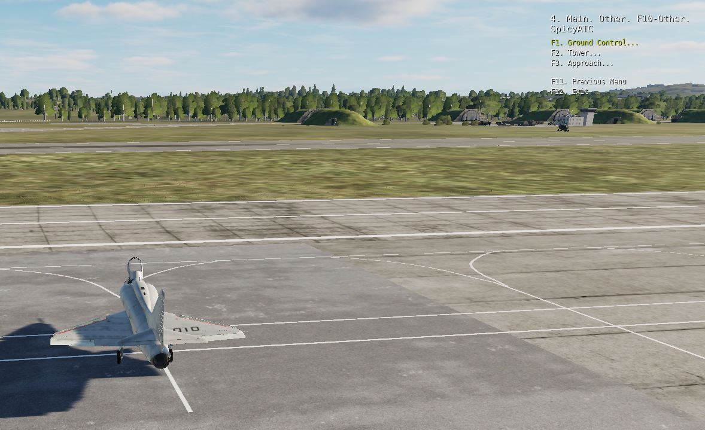

# SpicyATC

SpicyATC is a custom Lua script for Digital Combat Simulator (DCS) that replaces or augments the built‑in ATC system with a more realistic, BMS‑style sequence. It introduces state‑driven F10 radio menus, automatic airbase assignment, and simple but improved radio lines. The script is coalition‑aware and works in single‑player or co‑op missions (thats all i have tested. The logic is there for multiplayer. Every function probably wont work). ALSO, THERE IS NO WAY TO REMOVE DEFAULT ATC from DCS. I have tried. That thing will show up no matter what. Well, see if i figure it out.

Built by Spicy @spicy2160 (discord)

## Features

- Automatic home base assignment – when a player spawns, the script finds the nearest airbase owned by their coalition and sets it as their home base. (this can be changed at any time)

- State‑driven ATC flow – follows a logical sequence: Startup → Taxi → Takeoff → Handoff → Inbound → Approach → Landing → Parking → Shutdown. Most menu Options force you to follow the steps.

- Simplified radio messages – taxi and takeoff instructions omit specific taxiways and runways but still feel authentic. Each message tells the player who to contact next. I plan to expand on this heavily.

- Hand-offs for radio controllers. Like BMS, I have added a "hand-off" I also want to expand on these

- Queue management – the script queues aircraft for takeoff and landing and notifies each pilot of their position. (this is untested but i think should work lol)

- Redundancy – if a player requests taxi clearance again after already being cleared, the script repeats the original clearance instead of returning an error. (I will work on more robust error handling. However it wont crash)

- Automatic landing and "inbound detection".

## Installation

1. Download the spicyATC.lua file from the latest release.

2. Copy the script into your DCS mission’s Scripts folder or another location of your choice. (C:\Users\{user}\Saved Games\DCS\Scripts)

3. In the DCS Mission Editor, add a trigger at mission start (i use the following):

- Trigger: ONCE, NO EVENT

- Condition: Time More (1 second)

- Action: "Do Script File" and point it to spicyATC.lua

4. Save and run your mission. (Script should work on start-up)

No additional mods or tools are required.

## Usage (I am going to make a tutorial video, not right now.)

When you start the mission, open the F10 menu and select SpicyATC. You will see submenus for Ground, Tower, and Slasher (idk what this is called in BMS, for now pretend it is your overlord). I have tested it for jets and know that it works for now. Helicopters are most likely not full function. I have tested on red and blue coalition.

At any point, under the ground menu, hit refresh airbase list, and then return to ground menu, to change your home airbase.

Follow the sequence of calls:

- Ground → Request Startup
Clears you (or your flight) to start engines.

- Ground → Request Taxi
Provides taxi instructions and hands you off to the tower.

- Tower → Request Takeoff
Places you in the takeoff queue; when first in line, you are cleared to depart and told to contact again for hand‑off.

- Tower → Request Handoff
After becoming airborne, triggers a hand‑off to Slasher, advises you to check in.

- Slasher → Check In
Acknowledge the hand‑off; Slasher tells you to fly your mission.

- Slasher → Request Inbound
On your way back, request inbound; Slasher confirms and tells you to call for approach clearance. (I also have auto detection logic. If you are within 10 NMs you can call in, or watch for approach alert)

- Slasher → Request Approach
This is automatic, or if you feel the need to do it, it will work within 10nms, otherwise will tell you that you are too far.

- Tower → Request Landing
Clears you to land or informs you of your position in the landing queue, Tells u to contact ground for taxi.

- Ground → Taxi to Parking
Once landed and stopped off of runway, call for taxi clearance and instructions.

- Ground → Shutdown
The ground crew will tell you that you are cleared for shutdown, and sign off.

If you call a step out of sequence (e.g., request taxi before startup), the script will let you know.

## Plans for updates

While I have grinded out the framework, I expect the releases to slow down just a bit. Below are things I plan on adding.

## High priority : 
- Vectors for take-off and landing ()
- Runway detection for takeoff and landing instructions. DCS default ATC does this right now so I wasnt so worried about this.
- Ensure multiplayer support (i think im already done but dont have time to test)
- Voice lines for all radio calls and variety (I have a very talended @WhiskeyTangoFoxtrot working on a full suite of recordings for the alpha release. Those will follow soon! Thank them lots)
- Helicopter support (I have worked on this already, but have a few final things to hammer out. Expect this soon)
- A wider range of radio messages

## Not so high priority (things not started yet):
- Working radio frequency (this is very mission editor heavy and i have not figured out how to do this yet)
- Dynamic menu (ed makes it very static to add a menu to top right. I would have to code every single instance of a menu)
- More radio options, for awacs and such. Need to figure out how to force triggers for awacs.

## Things planned but are far away
- I want it to run completly dynamically. ED doesnt keep track of taxi lanes, so having it tell you where to taxi, is either going to have to be hard coded, or im going to have to find a way to track them.
- Translations for radio lines + messages
- A faster version (i am doing a ton of cordinate + speed math). It can for sure detect states faster. LUA isnt fun to try and make efficient.

# Contributing + credits

Suggestions for Bug fixes, new features, or improvements to realism are welcome. I also will happily accept development help with this. Please message me on discord or github or reddit. I work a ton and don't have the time of day to write, test, and maintain this at the rate I have been. Same with voice lines, whatever else.

## License

This project is released under the MIT license. You have my permission to do whatever you see fit with it, as long as I get credit.
